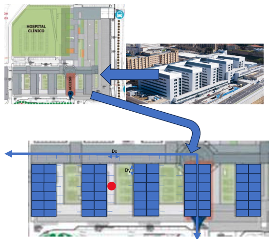

# Algoritmo A* que optimiza el consumo de rutas

Este proyecto de Java fue desarrollado como parte de la práctica de sistemas de búsqueda del curso "FUNDAMENTOS DE SISTEMAS INTELIGENTES" del cuarto curso del grado en Ingeniería Informática.

## Descripción del Problema

Se plantea el problema de un drone marca DfM como dispensador de medicamentos para el Complejo Asistencial Universitario de Salamanca (CAUSA). El plano donde se desarrolla la actividad se muestra en la figura que aparece a continuación. El edificio es de 8 alturas con una altura por piso Dz de 3.5 m. Respecto a las distancias en el plano, tanto Dx como Dy toman un valor de 8m. 

El punto de partida en todos los casos es la coordenada (0 Dx,0 Dy,8 Dz), considerando como unidades básicas las descritas, situada en el helipuerto del edificio, y los destinos son las habitaciones a las que se accede por el exterior (para eso vuelan a alta velocidad) y en las habitaciones se colocan pequeños salientes o zonas de descarga, escamoteables, donde el drone aterriza y suelta el medicamento del enfermo. En la figura aparece una habitación que en Prolog se describiría como habitación(h1,9,3,2).

El objetivo del proyecto es utilizar un algoritmo A* para encontrar las secuencias de movimientos óptimas que minimicen el consumo de energía del drone. Se deben considerar diversas restricciones:

- El costo de ascender una planta es el doble que el de avanzar en el plano, da igual la dirección X o Y, una (1) casilla.
- El consumo en el ascenso es cuatro veces al de descender un nivel de habitaciones.
- Como reglas de movimiento debido a un buen sistema de navegación, se consideran las siguientes: o +Dx, -Dx o +Dy, -Dy o +Dz, -Dz.
- La descarga de una medicina requiere de 3 CE.
- El drone dispone de una carga útil de 5 medicinas.
- Su tiempo de carga es de 2 horas para una capacidad de 100 unidades de carga.

